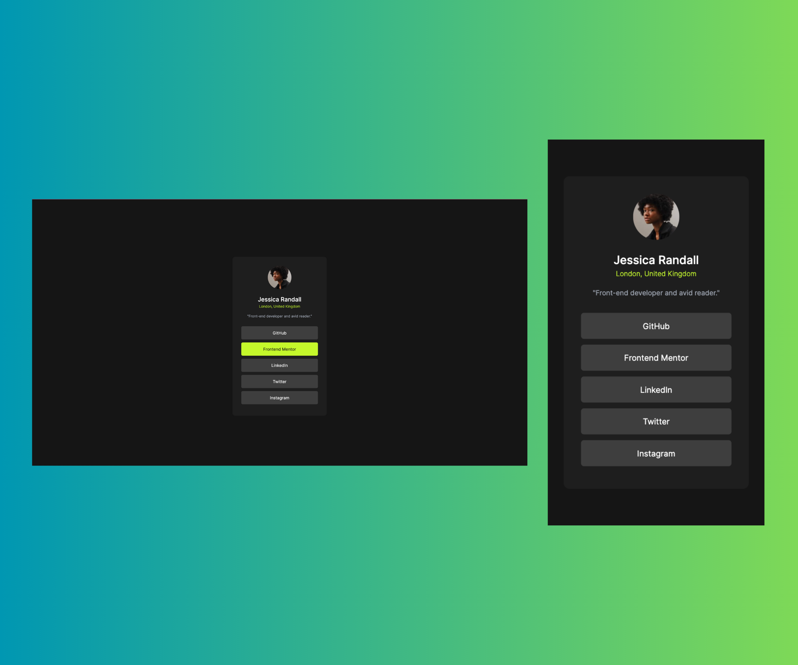

# Frontend Mentor - Social links profile solution

This is a solution to the [Social links profile challenge on Frontend Mentor](https://www.frontendmentor.io/challenges/social-links-profile-UG32l9m6dQ).

## Table of contents

- [Overview](#overview)
  - [The challenge](#the-challenge)
  - [Screenshot](#screenshot)
  - [Links](#links)
- [My process](#my-process)
  - [Built with](#built-with)
  - [What I learned](#what-i-learned)
  - [Useful resources](#useful-resources)
- [Author](#author)

## Overview

### The challenge

Users should be able to:

- See hover and focus states for all interactive elements on the page

### Screenshot



### Links

- Solution URL: [source code URL](https://github.com/Omowunmikamil/social-links-profile-main)
- Live Site URL: [netlify hosting page](https://socialprofilelink007.netlify.app)

## My process

### Built with

- Semantic HTML5 markup
- Mobile-first workflow
- [tailwindcss](https://tailwindcss.com) - CSS framework

### What I learned

I had leant how incredibly beautiful it is to use tailwindcss to build simlessly responsive projects

```html
<div class="flex flex-col justify-center items-center">
  
  <h2 class="font-sans font-medium text-white">Jessica Randall</h2>
  <p class="text-green font-light text-[12px]">London, United Kingdom</p>
</div>
<p class="text-gray-400 text-[12px] text-center mt-3 mb-5">
  "Front-end developer and avid reader."
</p>
<a href="https://github.com/Omowunmikamil" class="decoration-none">
  <p
    class="bg-gray600 mt-2 text-center py-2.5 px-3 rounded h-9 text-white text-[14px] hover:bg-green active:bg-green-700 focus-color focus:color-green-500 hover:text-gray900"
  >
    GitHub
  </p>
</a>
```

```tailwind.config
/** @type {import('tailwindcss').Config} */
module.exports = {
  content: ["./src/**/*.{html,js}"],
  theme: {
    extend: {
      colors: {
        green: "hsl(75, 94%, 57%)",
        white: "hsl(0, 0%, 100%)",
        gray700: "hsl(0, 0%, 20%)",
        gray800: "hsl(0, 0%, 12%)",
        gray900: "hsl(0, 0%, 8%)",
        gray600: "hsl(0, 0%, 24%)",
      },
      height: {
        247: "30rem",
      },
      fontFamily: {
        sans: ["Inter", "sans-serif"],
      },
      fontSize: {
        "2xs": ".625rem",
      },
    },
  },
  plugins: [],
};
```

### Useful resources

- [Tailwind CSS Docs](https://tailwindcss.com) - This helped me with the whole project build with a detailed guild. I really liked this pattern and will use it going forward.

## Author

- Frontend Mentor - [@Omowunmikamil](https://www.frontendmentor.io/profile/Omowunmikamil)
- Twitter - [@Browser_Nerd](https://x.com/Browser_Nerd)
